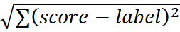
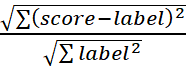
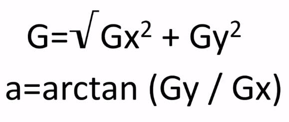
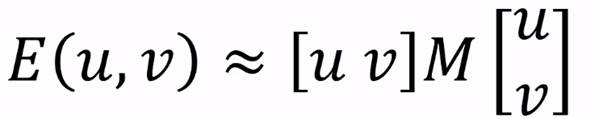

# A.I and Machine Learning Microsoft Course

## Supervise learning

## Regression

Measure error in regression model:

1. RMSE root mean square absolute error =  eg. RMSE is 5 , 5 calories

2. MAE mean absolute error = 1/n ∑ abs(score – label)

Relative metrics:

1. RSE root squared error = 

2. RAE relative absolute error = ∑ abs(score – label) / ∑ label

3. CoD coefficient of determination (R^2) = 1- var(score – label) / var(label)

## Classification

1. Accuracy of model = (TP+TN) / (TP + FP + TN + FN)

2. precision = TP / (TP + FP)

   a.    A more useful metric might be the fraction of cases classified as positive that are actually positive

3. Recall a.k.a. true positive rate = TP / (TP + FN)

   a.    In some situations we might want a metric that's sensitive to the fraction of positive cases we correctly identify

4. False positive rate = 

5. Roc = true positive rate and false positive rate 

https://medium.com/greyatom/performance-metrics-for-classification-problems-in-machine-learning-part-i-b085d432082b

## **Ultimate cheat sheet:  ** https://becominghuman.ai/cheat-sheets-for-ai-neural-networks-machine-learning-deep-learning-big-data-678c51b4b463

 

https://turi.com/learn/userguide/evaluation/classification.html

 

## Unsupervised learning

### Clustering

K means clustering
 pca = principal component analysis

Plotting = seaborn 

Normalizing data = z-score, MinMax, etc.

### Classification model:

Note: if there is a data column that more than 80% of it is one elemnt, we can Ln it to make it more normal, (remember the age in diabetes example)

## Language and communication

Word frequency is not that good

Term frequency and inverse document frequency:

TF is relative frequency of term in document

IDF: This is a measure of the relative number of documents within which the term appears. It's calculated as the log of total documents divided by the number of documents containing the term. Log(docs/ docs with term)

TF-IDF is multiply of IDF to TF.

### Stemming

Stemming is a technique used to identify words with a common root and count them as the same. A common technique is to use something called the **Porter** algorithm, which defines a sequence of rules for breaking words down into a common stem based on the pattern of consonants, vowels, common letter combinations and word endings, and other syntactical elements.

### Sentiment analysis

Feature hashing:

n-grams : doeas this word occure in tweet or not.

Two class boosted decision tree algorithm

## Image processing 

### Normalizing picture,

PVD = Pixel value distribution 

CDF = cumulative distribution function 

Filters:

Gaussian filter= it make a average of pixels and make blurs

Median filter: alternative a median filter works in the same way as a Gaussian filter except that it applies the median value to the center pixel this approach can be better for removing small areas of noise in detailed images as it tends to keep the pixel values that are in the same area of the image alike regardless of how close they are to a contrasting area

### Edge detection:

the image similar to Gaussian a median filters that you saw previously however this time the matrix that we apply is a two-stage masking function that is applied to the pixel intensity values in the image to calculate a gradient value based on changes in intensity this mask is apply to find the horizontal gradient for each pixel let's call it Gx and then this mask is applied to detect the vertical gradients which we'll call Gy we then add the squares of the x and y gradient values that are calculated for each pixel and we take the square root to determine a gradient value for each pixel and we can calculate the inverse tangent of those values to determine the angle of the edges that have been detected

### Corner detection:

Harris algorithm

